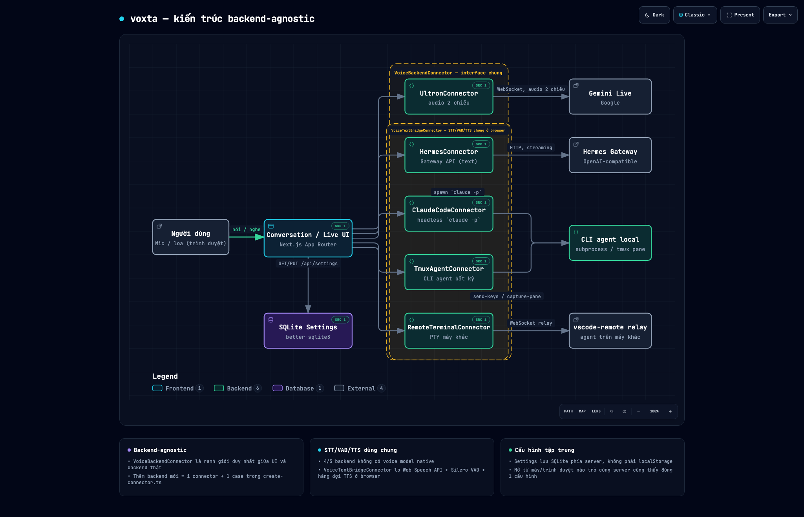

<p align="center">
  
</p>

<h1 align="center">voxta</h1>

<p align="center">
  <strong>Voice-first client cho các agent platform tự host.</strong><br/>
  Chạm 1 nút, nói, nghe trả lời — hoặc gõ chat kiểu Gemini. Cùng 1 giao diện, đổi qua lại giữa
  Ultron, Hermes, Claude Code, bất kỳ CLI agent nào (qua tmux/SSH), hay 1 terminal trên máy khác.
</p>

<p align="center">
  <a href="https://www.npmjs.com/package/@hanoilab/voxta"></a>
  
  
  
  
</p>

<p align="center">
  
</p>

> Tên "voxta" là tên tạm (ghép *vox* — tiếng Latin nghĩa "giọng nói" — với hậu tố ngắn gọn), đổi
> tuỳ ý khi dự án cần một cái tên chính thức.

## Tính năng

- **2 chế độ giao tiếp, 1 giao diện** — **Conversation** (gõ chat, hiện tool-call/thinking dạng
  khối gập lại, giống Gemini/Claude) và **Live** (orb phát sáng đổi màu theo trạng thái nghe/nghĩ/
  nói, không cần nhìn màn hình). Chuyển qua lại tự do, cùng 1 luồng hội thoại.
- **Backend-agnostic** — `VoiceBackendConnector` là ranh giới duy nhất giữa UI và backend thật.
  Thêm backend mới chỉ cần 1 connector + 1 dòng map, không đụng UI.
- **5 backend đã hỗ trợ**:
  - **Ultron** — relay đầy đủ qua WebSocket, backend tự giữ kết nối Gemini Live (voice model
    native, không qua STT/TTS phía client).
  - **Hermes Agent** — Gateway API dạng text (OpenAI-compatible); voxta tự lo STT (Web Speech
    API), phát hiện dừng nói bằng **Silero VAD thật** (không phải đếm giờ), và TTS.
  - **Claude Code** — điều khiển 1 project code thật bằng giọng nói/chat: `claude -p` headless
    như subprocess, hỗ trợ **chọn tiếp tục session cũ** ngay trong Settings (đọc thẳng transcript
    Claude Code đã lưu).
  - **Terminal Agent (tmux)** — generic cho BẤT KỲ CLI agent tương tác nào (Codex, Claude Code,
    Aider, hay `ssh user@host` để điều khiển 1 shell/agent trên máy khác) — gõ/đọc màn hình qua
    tmux thay vì API riêng của từng agent.
  - **Remote Terminal** — điều khiển terminal trên máy đứng sau NAT (không SSH thẳng được) qua
    relay WebSocket của [vscode-remote](https://github.com/nguyendinhphongdx/vscode-remote); có
    panel `xterm.js` tương tác trực tiếp ở `/live-terminal`, không chỉ nghe mà còn xem được output.
- **Trả lời được đọc theo từng câu ngay khi model sinh ra** (streaming), audio câu kế tiếp được
  tải trước trong lúc câu hiện tại đang phát — không có khoảng lặng chờ mạng giữa các câu.
- **Cấu hình dùng chung mọi thiết bị** — lưu SQLite phía server thay vì `localStorage`, mở voxta
  từ browser/máy nào trỏ vào cùng server cũng thấy đúng 1 cấu hình.
- **PWA** — cài vào màn hình chính (iOS/Android), full-screen không thanh URL, hoạt động qua
  Service Worker network-first.

## Kiến trúc

Next.js App Router — 1 process vừa serve frontend vừa có API route riêng (cần server vì
`better-sqlite3` là native module, và để giấu API key TTS/relay khỏi trình duyệt).

**Tech stack**: Next.js 16 · React 19 · TypeScript · Tailwind CSS v4 · shadcn/ui (Base UI) ·
Zustand · better-sqlite3 · `@ricky0123/vad-web` (Silero VAD) · `@xterm/headless` + `@xterm/xterm`

### Cấu trúc thư mục

```
src/
├── app/                        # Next.js App Router
│   ├── api/                    #   settings · claude-code (chat/sessions) · tmux-agent · tts
│   ├── settings/ live/ live-terminal/   # route riêng cho từng màn
│   └── page.tsx                #   Conversation view (trang chủ)
│
├── features/                   # UI theo tính năng — mỗi feature có store + hooks + components
│   ├── conversation/           #   chat + message list + agent-session (chat text)
│   ├── call/                   #   màn Live (CallOrb, VoiceWave, useCallStore)
│   ├── live-terminal/          #   panel xterm.js tương tác cho backend Remote Terminal
│   └── settings/                #   1 component field-group riêng cho mỗi backend
│
├── connectors/                  # Backend-agnostic voice pipeline
│   ├── types.ts                 #   VoiceBackendConnector — interface chung mọi backend
│   ├── voice-text-bridge.ts     #   base dùng chung: STT/VAD/hàng đợi TTS cho backend chỉ có text
│   ├── create-connector.ts      #   factory: settings -> connector cụ thể
│   ├── ultron/ hermes/ claude-code/ tmux-agent/ remote-terminal/
│
├── audio/                       # Mic capture (AudioWorklet) + playback streaming — cho Ultron
├── components/ui/               # shadcn/ui primitives
└── lib/                         # settings (client+server), SQLite (db.ts), tmux-agent.ts

bin/cli.js            # CLI global khi cài qua npm (start/stop/status/logs/install...)
scripts/               # prepare-standalone.sh, docker-ssh-setup.sh
.changeset/            # quản lý version — xem "Phát triển & release" bên dưới
```

### Nguyên tắc thiết kế

- **`VoiceBackendConnector`** (`src/connectors/types.ts`) là ranh giới duy nhất giữa UI và backend
  thật — UI không biết Ultron hay Hermes làm gì bên trong, chỉ gọi qua interface này.
- Connector có cờ **`managesOwnAudio`**: Ultron dùng chung `MicCapture`/`AudioPlayer` của voxta;
  4 backend còn lại kế thừa **`VoiceTextBridgeConnector`** (STT qua Web Speech API + Silero VAD +
  hàng đợi TTS) vì không có voice model native.
- **State quản lý bằng Zustand** (`useCallStore`, `useConversationStore`, `useSettingsStore`) —
  không prop-drilling qua nhiều tầng component.
- Mọi màu trạng thái cuộc gọi (nghe/nghĩ/nói/lỗi) là **design token** (`--voice-*` trong
  `globals.css`), dùng lại xuyên suốt CallOrb, VoiceWave và pill badge trạng thái.

## Bắt đầu nhanh

**Yêu cầu**: Node.js 22+, pnpm, Chrome hoặc Edge (4/5 backend dùng Web Speech API — không chạy
trên Safari/Firefox, xem [Giới hạn hiện tại](#giới-hạn-hiện-tại)).

```bash
pnpm install
pnpm dev
```

Mở `http://localhost:3000`, bấm biểu tượng cài đặt để chọn backend.

## Cách chạy production

3 cách, tuỳ nhu cầu:

### 1. Cài như CLI global (khuyến nghị cho máy cá nhân)

```bash
npm install -g @hanoilab/voxta
voxta start              # chạy nền, mặc định port 3000
voxta open               # mở trang Settings
voxta install            # tự khởi động cùng lúc đăng nhập máy, tự restart nếu crash
voxta logs -f            # xem log
voxta stop
```

Chạy **native trên chính máy bạn** — nghĩa là `claude`/`tmux`/PATH/Keychain đều là của phiên đăng
nhập thật, không có vấn đề gì với Claude Code hay SSH. Dữ liệu lưu ở `~/.voxta/`.

### 2. Docker

```bash
pnpm docker:up      # build + chạy, có port 3000 ra localhost để test
pnpm docker:logs
pnpm docker:down
```

Production (không lộ port, đứng sau reverse proxy/Tailscale):

```bash
docker compose up -d --build
```

Image có sẵn `tmux` + `openssh-client` (đủ cho Terminal Agent qua `ssh user@host`). `claude` CLI
**không** bundle sẵn (cần đăng nhập tài khoản cá nhân) — dùng `docker-compose.ssh.yml` (mount SSH
key, xem `scripts/docker-ssh-setup.sh`) để SSH ngược ra host đã có `claude` đăng nhập sẵn thay vì
cài lại trong container.

### 3. Build tay + chạy `next start`

```bash
pnpm build
pnpm start
```

## Cấu hình backend

### Ultron

Cần 1 backend Ultron đang chạy (`apps/api` + Postgres):

| Field | Ghi chú |
|---|---|
| Ultron API URL | mặc định `http://localhost:8000` |
| Agent ID | để trống = agent mặc định theo `AppSettings` của Ultron |

> **CORS**: Ultron mặc định chỉ cho phép origin `localhost:3010` — cần thêm origin của voxta vào
> `CORS_ORIGINS` trong `apps/api/.env` của Ultron rồi restart server đó.

### Hermes Agent

Cần Gateway API của Hermes đang chạy (`docker compose up -d` trong `tools/hermes-agent`):

| Field | Ghi chú |
|---|---|
| Hermes Gateway URL | mặc định `http://localhost:8642` |
| API Server Key | key thật nằm trong `data/.env` **bên trong container** Hermes |
| Model | vd `hermes-agent`, để trống dùng mặc định server |

### Claude Code

Cần [Claude Code CLI](https://claude.com/claude-code) đã cài và đăng nhập trên máy chạy voxta
(`claude` phải nằm trong `PATH` của process chạy voxta).

| Field | Ghi chú |
|---|---|
| Project Directory | thư mục Claude Code sẽ chạy trong đó — bắt buộc |
| Đường dẫn claude CLI | để trống = tự dò qua login shell |
| Tiếp tục session | chọn 1 session cũ để `--resume` thay vì bắt đầu mới — đọc thẳng transcript Claude Code đã lưu ở `~/.claude/projects/` |

> **⚠️ Cảnh báo**: backend này chạy `claude -p` với `--dangerously-skip-permissions` — có thể sửa
> file, chạy lệnh thật trong Project Directory **không cần xác nhận**, chỉ dựa trên văn bản STT/
> chat nhận diện được. Chỉ trỏ vào project bạn chấp nhận rủi ro đó.

### Terminal Agent (tmux)

Generic cho bất kỳ CLI agent tương tác nào — cần [tmux](https://github.com/tmux/tmux) đã cài.

| Field | Ghi chú |
|---|---|
| Lệnh khởi động | vd `codex`, `claude`, hoặc `ssh -t user@host claude` để điều khiển máy khác |
| Project Directory | thư mục agent chạy trong đó — bắt buộc |

Nếu SSH ra máy khác lần đầu, thêm `-o StrictHostKeyChecking=accept-new` để tự chấp nhận host key
(tránh treo chờ xác nhận "yes/no").

### Remote Terminal

Dùng khi máy đích **không SSH thẳng được** (sau NAT) và đã có sẵn agent+relay của
[vscode-remote](https://github.com/nguyendinhphongdx/vscode-remote) (`opencode start` trên máy
đích).

| Field | Ghi chú |
|---|---|
| Relay URL | vd `https://your-relay.example.com` |
| Machine ID | hiện trong `opencode status` trên máy đích |
| Password | password đăng nhập agent — hỏi thêm mã OTP qua dialog nếu agent bật 2FA |

Mở `/live-terminal` để vừa nói chuyện vừa **xem** output trong panel terminal tương tác.

**Giọng đọc trả lời** (dùng chung cho Hermes/Claude Code/Terminal Agent/Remote Terminal — Ultron
dùng thẳng voice model của Gemini Live):

- **Trình duyệt** (mặc định) — miễn phí, `SpeechSynthesis` có sẵn, chất lượng thấp.
- **OpenAI TTS** — cần API key từ [platform.openai.com](https://platform.openai.com/api-keys).
- **Google Cloud TTS** — bật *Cloud Text-to-Speech API* trong Google Cloud Console, tạo API key
  dạng `AIzaSy...` (không phải key Google AI Studio/Gemini).

## Phát triển & release

Version quản lý bằng [Changesets](https://github.com/changesets/changesets) — không tự tay
`git tag`:

```bash
pnpm changeset          # chọn patch/minor/major + mô tả -> tạo file trong .changeset/
git add . && git commit -m "..." && git push
```

Push lên `main` có kèm file changeset → GitHub Action tự bump version + `CHANGELOG.md` (commit
thẳng, không qua PR) → build + publish lên npm trong cùng lần chạy. Xem
`.github/workflows/publish.yml`.

## Giới hạn hiện tại

- Backend Hermes, Claude Code, Terminal Agent và Remote Terminal chỉ chạy **Live (giọng nói)** tốt
  trên Chrome/Edge (Web Speech API không được Safari/Firefox hỗ trợ đầy đủ) — **kể cả trên PWA cài
  vào iOS**, vì đây là giới hạn của WebKit, không phải của voxta. Chat gõ text (Conversation view)
  không bị ảnh hưởng, dùng được trên mọi trình duyệt/thiết bị.
- Terminal Agent không streaming theo token thật (phải chờ agent nói xong 1 lượt mới đọc) — giới
  hạn cố hữu của cách gõ/đọc màn hình, không phải bug.
- VAD (`@ricky0123/vad-web`) tải model ONNX từ CDN lúc bắt đầu cuộc gọi — cần Internet ở bước đó.
- Không backend nào hỗ trợ barge-in (ngắt lời model đang đọc) — mic tạm dừng trong lúc TTS phát.
- Claude Code chạy với `--dangerously-skip-permissions` — xem cảnh báo ở phần cấu hình phía trên.
- Chat gõ text và Live dùng **connector/history riêng biệt** — hỏi qua Live rồi hỏi tiếp qua text
  (hay ngược lại) sẽ không có ngữ cảnh liên tục phía backend, dù cùng hiện trên 1 feed UI.

## License

MIT — xem [LICENSE](LICENSE).
